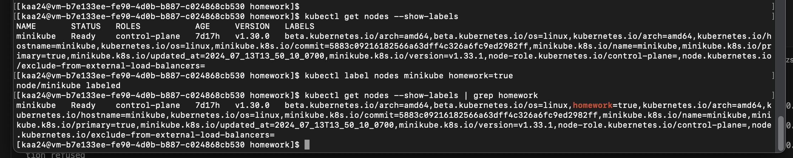
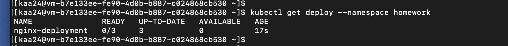
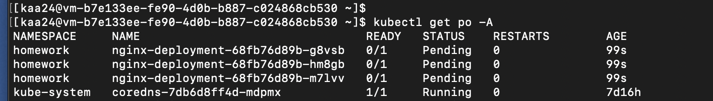
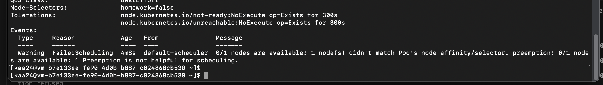
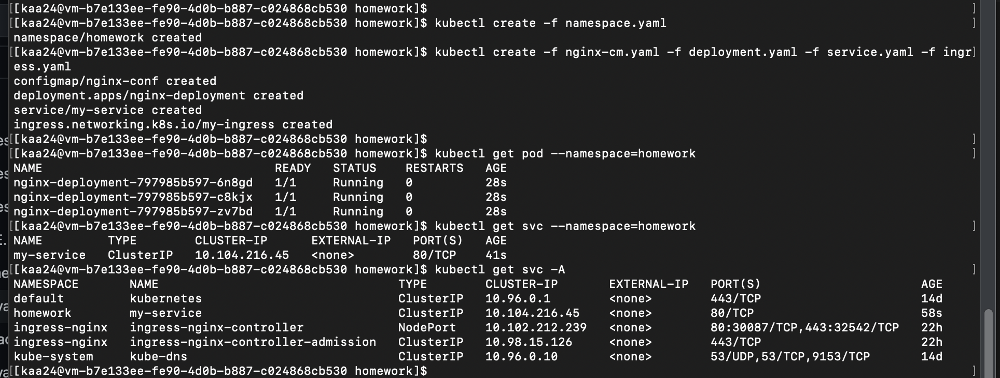
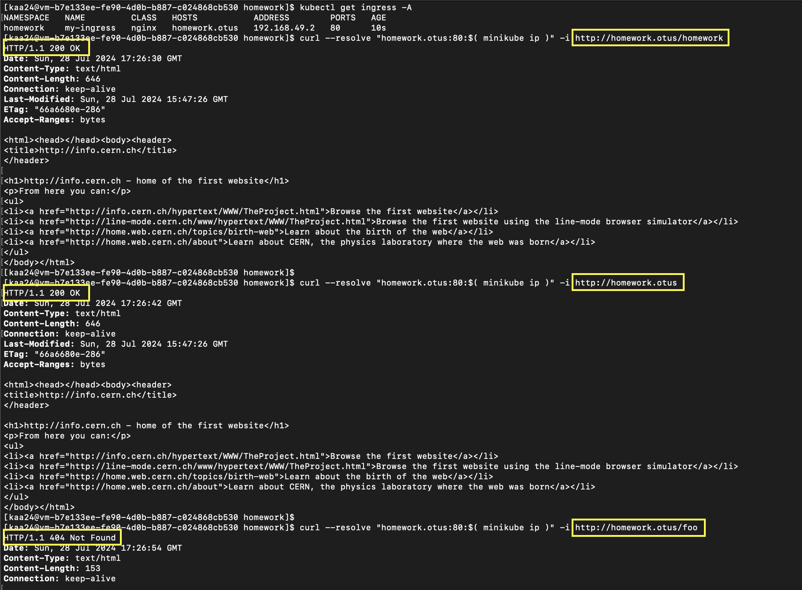
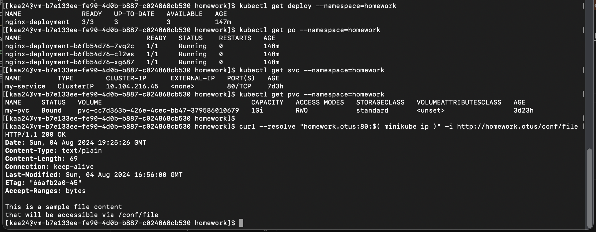
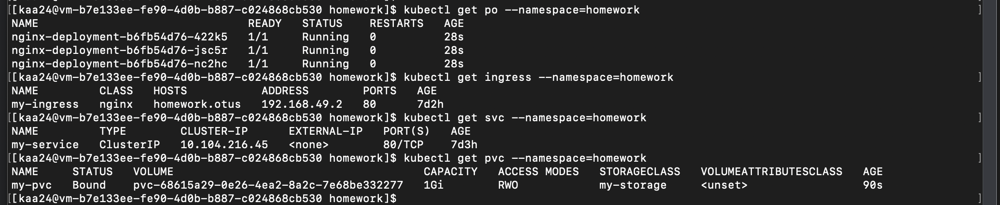

# Репозиторий для выполнения домашних заданий курса "Инфраструктурная платформа на основе Kubernetes-2024-06" 

## Пошаговая инструкция выполнения домашнего задания #1
1. Для выполнения домашнего задания вам потребуется установить Minikube. 
Если вы по каким-то причинам предпочитаете работать с другими локальными инсталляциями k8s можете использовать их, для выполнения ДЗ это не принципиально.
2. Установите утилиту kubectl
3. Необходимо создать манифест **namespace.yaml** для namespace с именем **homework**
4. Необходимо создать манифест **pod.yaml**. Он должен описывать под, который:
	- Будет создаваться в namespace homework
	- Будет иметь контейнер, поднимающий веб-сервер на 8000 порту и отдающий содержимое папки /homework внутри этого контейнера.
	- Будет иметь init-контейнер, скачивающий или генерирующий файл index.html и сохраняющий его в директорию /init
	- Будет иметь общий том (volume) для основного и init- контейнера, монтируемый в директорию /homework первого и /init второго
	- Будет удалять файл index.html из директории /homework основного контейнера, перед его завершением

## Пошаговая инструкция выполнения домашнего задания #2
1. Необходимо создать манифест namespace.yaml для namespace с именем homework
2. Необходимо создать манифест deployment.yaml. Он должен описывать deployment, который:
	- Будет создаваться в namespace homework
	- Запускает 3 экземпляра пода, полностью
	аналогичных по спецификации прошлому ДЗ.
	- В дополнение к этому будет иметь readiness пробу, проверяющую наличие файла /homework/index.html
	- Будет иметь стратегию обновления RollingUpdate, настроенную так, что в процессе обновления может быть недоступен максимум 1 под
3. Задание с *
	- Добавить к манифесту deployment-а спецификацию, обеспечивающую запуск подов деплоймента, только на нодах кластера, имеющих метку homework=true
 (документация https://kubernetes.io/docs/tasks/configure-pod-container/assign-pods-nodes/ )

### Создание манифестов
Создаем манифест namespace.yaml
```
apiVersion: v1
kind: Namespace
metadata:
  name: homework
```

Создаем манифест deployment.yaml
```
apiVersion: apps/v1
kind: Deployment
metadata:
  name: nginx-deployment
  namespace: homework
  labels:
    app: nginx
spec:
  replicas: 3
  strategy:
    type: RollingUpdate
    rollingUpdate:
      maxSurge: 1
      maxUnavailable: 1
  selector:
    matchLabels:
      app: nginx
  template:
    metadata:
      labels:
        app: nginx
    spec:
        <тут описание Pod>
```

Для нашего веб-сервера также потребуется создать конфиг для volume nginx
```
apiVersion: v1
kind: ConfigMap
metadata:
  name: nginx-conf
  namespace: homework
data:
  nginx.conf: |
    events {}
    http {
      server {
          listen       8000;
          server_name  localhost;
          location / {
            root   /homework;
            index  index.html index.htm;
        }
      }
    }
```

### Запуск и проверка работоспособности
Применяем манифесты
`kubectl apply -f namespace.yaml`
`kubectl apply -f nginx-cm.yaml -f deployment.yaml`

Проверяем что все 3 экземпляра запущены
`kubectl get po -A`


Заходим в терминал пода веб-сервиса
`kubectl exec -it deploy/nginx-deployment --namespace homework -- bash`

Проверяем что применился наш конфиг nginx
`cat /etc/nginx/nginx.conf`

Делаем http запрос к сервису
`curl localhost:8000`
Если получаем страницу, которую ранее выгрузил инит-контейнер, то все сделано правильно.


### Добавляем спецификацию, обеспечивающую запуск подов деплоймента, только на нодах кластера, имеющих метку homework=true
Проверяем список нод и их лейблы:
`kubectl get nodes --show-labels`
Выбираем ноду и выставляем для нее лейбл homework=true:
`kubectl label nodes minikube homework=true`
Удалить лейбл можно командой:
`kubectl label nodes minikube homework-`



Добавляем спецификацию с меткой в разделе spec для Pod:
```
  template:
    metadata:
      labels:
        app: nginx-with-node-affinity
    spec:
      nodeSelector:
        homework: "true"
      containers:
```

!Значение для метки должно быть строковым иначе получим ошибку при создании деплоймента.

Для проверки работы метки изменим значение на "false" и применим деплоймент




Меняем значение на "true", применяем манифест деплоймента и убеждаемся, что Pod успешно запустились.


## Пошаговая инструкция выполнения домашнего задания #3
1. Изменить readiness-пробу в манифесте deployment.yaml из прошлого ДЗ на httpGet, вызывающую URL /index.html
2. Необходимо создать манифест service.yaml, описывающий сервис типа ClusterIP, который будет направлять трафик на поды, управляемые вашим deployment
3. Установить в кластер ingress-контроллер nginx
4. Создать манифест ingress.yaml, в котором будет описан объект типа ingress, направляющий все http запросы к хосту homework.otus на ранее созданный сервис. В результате запрос http://homework.otus/index.html должен отдавать код html страницы, находящейся в подах.
5. Задание с *
- Доработать манифест ingress.yaml, описав в нем rewrite-правила так, чтобы обращение по адресу http://homework.otus/homepage форвардилось на http://homework.otus/index.html

Создаем манифест для Сервиса
```
apiVersion: v1
kind: Service
metadata:
  name: my-service
  namespace: homework
spec:
  ports:
  - port: 80
    targetPort: 8000
  selector:
    app: nginx-with-node-affinity
```

Создаем манифест для Ингресса
```
apiVersion: networking.k8s.io/v1
kind: Ingress
metadata:
  name: my-ingress
  namespace: homework
spec:
  ingressClassName: nginx
  rules:
    - host: homework.otus
      http:
        paths:
          - path: /
            pathType: Prefix
            backend:
              service:
                name: my-service
                port:
                  number: 80
```

Включаем контроллер NGINX Ingress в minikube
`minikube addons enable ingress`

Убеждаемся, что контроллер NGINX Ingress запущен
`kubectl get pods -n ingress-nginx`

Применяем все манифесты и проверяем, что все запустилось


Исправляем Ингресс для задания со *
```
  ...
  annotations:
    nginx.ingress.kubernetes.io/rewrite-target: /
	...
          - path: /homework
            pathType: Prefix
            backend:
              service:
                name: my-service
                port:
                  number: 80
```

Убеждаемся, что контроллер Ingress направляет трафик



## Пошаговая инструкция выполнения домашнего задания #4
1. Создать манифест pvc.yaml, описывающий PersistentVolumeClaim, запрашивающий хранилище с storageClass по-умолчанию
2. Создать манифест cm.yaml для объекта типа configMap, описывающий произвольный набор пар ключ-значение
3. В манифесте deployment.yaml 
- изменить спецификацию volume типа emptyDir, который монтируется в init и основной контейнер, на pvc, созданный в предыдущем пункте
- добавить монтирование ранее созданного configMap как volume к основному контейнеру пода в директорию /homework/conf, так, чтобы его содержимое можно было получить, обратившись по url /conf/file
4. Задание с *
- Создать манифест storageClass.yaml описывающий объект типа storageClass с provisioner https://k8s.io/minikube-hostpath и reclaimPolicy Retain
- Изменить манифест pvc.yaml так, чтобы в нем запрашивалось хранилище созданного вами storageClass- а

Применяем манифесты и проверяем работоспособность


Применяем манифест storageClass.yaml и измененный pvc.yaml. Проверяем

