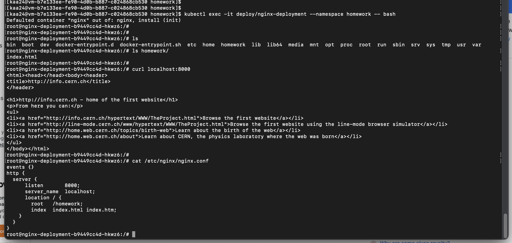

# Репозиторий для выполнения домашних заданий курса "Инфраструктурная платформа на основе Kubernetes-2024-06" 

## Пошаговая инструкция выполнения домашнего задания #2
- Необходимо создать манифест namespace.yaml для namespace с именем homework
- Необходимо создать манифест deployment.yaml. Он должен описывать deployment, который:
	- Будет создаваться в namespace homework
	- Запускает 3 экземпляра пода, полностью
	аналогичных по спецификации прошлому ДЗ.
	- В дополнение к этому будет иметь readiness пробу, проверяющую наличие файла /homework/index.html
	- Будет иметь стратегию обновления RollingUpdate, настроенную так, что в процессе обновления может быть недоступен максимум 1 под
	Задание с *
	- Добавить к манифесту deployment-а спецификацию, обеспечивающую запуск подов деплоймента, только на нодах кластера, имеющих метку homework=true

### Создание манифестов
Создаем манифест namespace.yaml
```
apiVersion: v1
kind: Namespace
metadata:
  name: homework
```

Создаем манифест deployment.yaml
```
apiVersion: apps/v1
kind: Deployment
metadata:
  name: nginx-deployment
  namespace: homework
  labels:
    app: nginx
spec:
  replicas: 3
  strategy:
    type: RollingUpdate
    rollingUpdate:
      maxSurge: 1
      maxUnavailable: 1
  selector:
    matchLabels:
      app: nginx
  template:
    metadata:
      labels:
        app: nginx
    spec:
        <тут описание Pod>
```

Для нашего веб-сервера также потребуется создать конфиг для volume nginx
```
apiVersion: v1
kind: ConfigMap
metadata:
  name: nginx-conf
  namespace: homework
data:
  nginx.conf: |
    events {}
    http {
      server {
          listen       8000;
          server_name  localhost;
          location / {
            root   /homework;
            index  index.html index.htm;
        }
      }
    }
```

### Запуск и проверка работоспособности
Применяем манифесты
`kubectl apply -f namespace.yaml`
`kubectl apply -f nginx-cm.yaml -f deployment.yaml`

Проверяем что все 3 экземпляра запущены
`kubectl get po -A`


Заходим в терминал пода веб-сервиса
`kubectl exec -it deploy/nginx-deployment --namespace homework -- bash`

Проверяем что применился наш конфиг nginx
`cat /etc/nginx/nginx.conf`

Делаем http запрос к сервису
`curl localhost:8000`
Если получаем страницу, которую ранее выгрузил инит-контейнер, то все сделано правильно.


